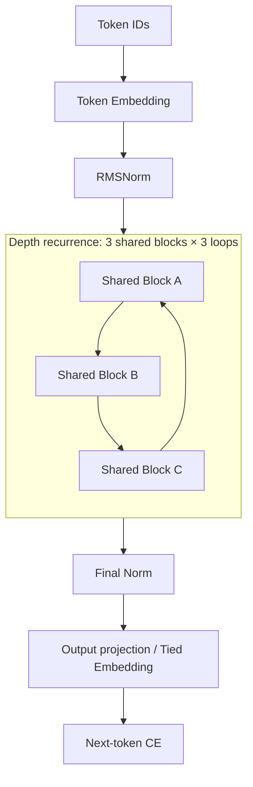
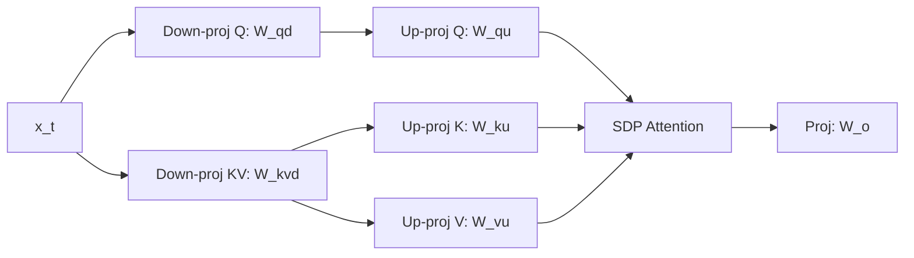
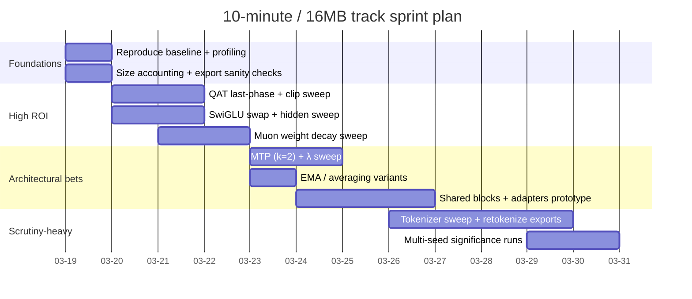

# Designing a Winning Parameter‑Golf Entry for the 10‑Minute / 16MB Track

## Executive summary

The current leaderboard “Naive Baseline” (10‑minute / 16MB track) achieves **final_int8_zlib_roundtrip_exact val_bpb = 1.22436570** with a **~15.863 MB** total submission artifact (≈15.815 MB compressed model + 47.6 KB code), training for **600.0 s** and stopping at **13,780 steps** (≈7.22B tokens seen at 524,288 tokens/step). citeturn1view0turn30view8turn30view0 The model uses **9 Transformer blocks, d_model=512, 8 attention heads with 4 KV heads (GQA), RoPE, ReLU² MLP (2× expansion), RMSNorm (no learned scale), tied embeddings**, plus a **U‑Net‑style skip reuse** across the depth with learnable skip weights. citeturn11view1turn8view1turn8view3turn8view4turn8view5

The baseline is already “non‑naive” in ways that matter for this challenge: it uses **Muon** (orthogonalized momentum) for most block matrices and Adam for the embedding/scalars, a **flat LR with wallclock‑aware warmdown multiplier**, BF16 compute with certain parameters retained in FP32, torch.compile, flash attention, and an **int8 per‑row quantization + zlib** export with post‑export roundtrip evaluation. citeturn11view2turn33view0turn9view0turn10view2turn24view0

The single most promising near‑term lever is **compression‑aware training to reduce quantization loss**: the baseline improves to **val_bpb ≈ 1.2172 pre‑quant**, but degrades to **1.2244 post‑quant roundtrip** (≈+0.0072 bpb loss). citeturn1view0turn30view8 Closing even half of that gap can beat the baseline without changing the underlying float model much.

A “maximum‑expected‑value” path to a winning entry is:

1. **Quantization‑aware finetune (QAT) during the last phase** + targeted quantization tweaks (clip percentile, scale dtype, keep‑float whitelist) to minimize post‑quant bpb, while keeping compressed size < 16,000,000 bytes. citeturn10view2turn13view6turn24view0turn18view0  
2. **Architecture upgrade per parameter**: swap ReLU² MLP for **SwiGLU** (or GEGLU) at matched parameter cost, and retune width/layers/KV heads to re‑fill the 16MB envelope. citeturn8view3turn30view0turn30view8  
3. Add **Multi‑Token Prediction (MTP)** as an auxiliary loss (predict 2nd future token) as in DeepSeek‑V3’s recipe; keep inference unchanged (still next‑token). citeturn25view0turn26view2  
4. Upgrade optimizer handling by bringing in **Muon weight decay + update‑scale hygiene** (per the “Muon is scalable…” report), aligned with the baseline’s existing Muon split. citeturn28view0turn33view2turn11view2  
5. If you can afford higher implementation risk, implement **shared blocks / depth recurrence** plus small per‑iteration adapters (LoRA‑style) to trade parameter budget for “effective depth” and specialization without exploding artifact size.

## Current Naive Baseline: architecture, training, and serialization pipeline

### Model shape and parameter accounting

The baseline configuration printed in logs is:

- vocab_size=1024, train_seq_len=1024, train_batch_tokens=524,288 tokens/step, iterations=20,000 with a 600s wallclock cap. citeturn11view0turn30view2  
- num_layers=9, model_dim=512, num_heads=8, num_kv_heads=4 (GQA), mlp_mult=2, tie_embeddings=True. citeturn11view1turn30view2  
- Logged parameter count: **17,059,912**. citeturn30view0

You can exactly reconstruct that parameter count from the implementation:

- Token embedding: `vocab_size × model_dim = 1024×512 = 524,288`. citeturn8view4turn11view1  
- Each block includes QKV and output projections implemented as bias‑free linear layers with GQA shapes (`c_q: 512→512`, `c_k: 512→256`, `c_v: 512→256`, `proj: 512→512`) plus a per‑head `q_gain`. citeturn8view3turn8view1  
- MLP is “relu²”: `fc: 512→1024`, `proj: 1024→512`. citeturn8view3  
- Each block has learned per‑dimension residual scales (`attn_scale`, `mlp_scale`) and a learned `resid_mix` that mixes the running stream `x` with the “early” representation `x0`. citeturn4view8turn5view5  
- The model organizes blocks into an encoder/decoder split and stores skip tensors from the first half to add back (scaled) in reverse order in the second half, with learnable `skip_weights` of shape `(min(enc, dec), model_dim)`. citeturn8view4turn5view5  
- Output is tied to token embeddings via `F.linear(x, tok_emb.weight)` when `tie_embeddings=True`. citeturn8view5

This “U‑Net depth with learnable skip scaling” is arguably the most “already‑smart” aspect of the baseline: it injects depth‑wise reuse of intermediate states without increasing parameter count very much (skip_weights is only 2,048 params here). citeturn8view4turn30view0

### Attention, positional encoding, normalization, and logits

Key architectural details (file: `train_gpt.py`):

- **RoPE**: rotary cos/sin tables cached per sequence length and device; applied to Q and K. citeturn9view2turn8view1  
- **GQA**: `scaled_dot_product_attention(... enable_gqa=(num_kv_heads != num_heads))`. citeturn8view1  
- **RMS normalization** is applied via `F.rms_norm` without learned scaling parameters (both in `RMSNorm` module and directly). citeturn9view0turn8view1turn8view4  
- **Logit soft‑cap**: logits are passed through `logit_softcap * tanh(logits/logit_softcap)` before cross‑entropy. citeturn8view5turn11view1

### Optimizers, parameter partitioning, and learning‑rate schedule

The optimizer setup is split into multiple optimizers:

- Token embedding: Adam with lr = `tied_embed_lr` if tied; otherwise `embed_lr`. Defaults are `TIED_EMBED_LR=0.05`, `EMBED_LR=0.6`. citeturn11view1turn32view1  
- Block matrix parameters (2D tensors excluding a control‑tensor name whitelist): **Muon** with `MATRIX_LR=0.04`, `MUON_MOMENTUM=0.95`, `MUON_BACKEND_STEPS=5`. citeturn11view1turn8view4turn11view3  
- Block scalars/vectors and “control” tensors: Adam with `SCALAR_LR=0.04`. citeturn11view1turn8view4turn32view1  
- LR application: every optimizer param group stores a `base_lr`, then each training step sets `group["lr"] = group["base_lr"] * scale`, where `scale = lr_mul(step, elapsed_ms)`. citeturn32view1turn33view0  
- Warmdown: `lr_mul()` is **piecewise linear**, and when `MAX_WALLCLOCK_SECONDS>0` it becomes wallclock‑aware by comparing remaining time to `warmdown_iters * step_ms`. Defaults: `WARMDOWN_ITERS=1200`, `MAX_WALLCLOCK_SECONDS=600`. citeturn11view0turn32view0turn33view0  
- Muon momentum is linearly warmed from `MUON_MOMENTUM_WARMUP_START=0.85` to `MUON_MOMENTUM=0.95` over `MUON_MOMENTUM_WARMUP_STEPS=500`. citeturn11view2turn33view0

Muon itself is implemented in‑script: it orthogonalizes the (momentum‑augmented) matrix gradient with a Newton‑Schulz iteration and applies a shape correction factor. citeturn11view3turn11view4

A notable practical detail: the script runs a “warmup” phase that takes optimizer steps, but then **restores the initial model weights and optimizer states**, so measured training starts from the true initialization while compilation paths are primed. citeturn32view2turn33view0

### Data streaming and the bpb metric

The baseline uses FineWeb shard files of `uint16` token IDs and streams them sequentially, wrapping forever; each rank slices a contiguous span to avoid per‑rank shuffling. citeturn6view6turn13view7turn11view0

Validation is on the fixed first‑50k‑document set (the repo explicitly treats it as fixed) and computes:

- `val_loss`: mean token cross‑entropy (nats).  
- `val_bpb`: `bits_per_token * tokens_per_byte`, where `bits_per_token = val_loss/log(2)` and `tokens_per_byte` is computed from tokenizer piece byte lengths with special handling for leading‑space markers and boundary tokens. citeturn10view1turn33view2

This “tokenizer‑agnostic compression metric” is why tokenizer sweeps are allowed but scrutinized. citeturn10view1turn11view4turn18view0

### Post‑training quantization and serialization

The baseline export format is:

- Quantize float tensors to int8 with:
  - **per‑row scales** for 2D tensors (matrices), stored in fp16 (`INT8_PER_ROW_SCALE_DTYPE = float16`) and using quantile clipping with `INT8_CLIP_PERCENTILE = 99.99984`. citeturn10view2turn13view7  
  - **per‑tensor scale** for non‑2D float tensors. citeturn15view0turn13view7  
  - small float tensors (≤65,536 elements) are passed through (stored as fp16 to keep metadata small), except a name‑pattern whitelist (control tensors) which are kept in fp32. citeturn10view2turn13view7  
  - the quantized object advertises `__quant_format__ = "int8_clean_per_row_v1"`. citeturn13view6

- Serialization pipeline:
  1. `quant_obj = quantize_state_dict_int8(base_model.state_dict())`
  2. `torch.save(quant_obj, BytesIO())` → raw bytes
  3. `zlib.compress(raw, level=9)`
  4. write `final_model.int8.ptz`
  5. roundtrip: read file → `zlib.decompress` → `torch.load` → `dequantize_state_dict_int8` → `load_state_dict` → evaluate and print `final_int8_zlib_roundtrip_exact`. citeturn24view0

In the Naive Baseline record, this yields:

- Pre‑quant end‑of‑run: `val_bpb=1.2172`.  
- Post‑quant roundtrip: `final_int8_zlib_roundtrip_exact val_bpb=1.22436570`. citeturn1view0turn30view8  
- Compressed model: **15,815,847 bytes**; total (model + code): **15,863,489 bytes**. citeturn1view0turn30view8  
- “Payload” accounting printed by the script: `payload: 17,178,912 bytes`, `payload_ratio: 3.91x`. citeturn30view8turn24view0

## Constraint analysis and size accounting

### What counts toward 16MB

The repository defines the submission artifact as **code bytes + compressed model bytes**, with a hard cap of **16,000,000 bytes (decimal MB)**, and the artifact must be self‑contained (no external downloads/network during evaluation). citeturn18view0

That means you should manage two budgets simultaneously:

- **Compressed model bytes**: dominated by your quantization + compression format. citeturn24view0turn30view8  
- **Code bytes**: computed as `len(Path(__file__).read_text(...).encode("utf-8"))` in the script’s logging. citeturn24view0turn30view8

### How to estimate “bytes per parameter” for planning

For the baseline model:

- Params: 17,059,912. citeturn30view0  
- Compressed model: 15,815,847 bytes. citeturn30view8  
- Effective compressed bytes/param ≈ 0.927 B/param (very rough; depends on scale overhead and zlib ratio).

A more accurate approach (and the one you should use in practice) is to rely on the script’s own accounting:

- `quant_stats["int8_payload_bytes"]` is the exact payload (int8 tensors + scale tensors + passthrough tensors). citeturn13view7turn24view0  
- The actual compressed model size is `os.path.getsize("final_model.int8.ptz")`. citeturn24view0  

For architectural planning, you can compute “payload bytes per tensor type” approximately:

- For a weight matrix `W ∈ R^{out×in}` quantized per‑row:  
  - int8 weights: `out*in` bytes  
  - fp16 scales: `out*2` bytes  
- For a vector length `n` quantized per‑tensor: `n` bytes + a scalar scale tensor (fp32) metadata overhead. citeturn15view0turn10view2  

The zlib factor is model‑dependent. The baseline compresses `payload 17.18MB → file 15.82MB`, i.e. ~0.92×. citeturn30view8turn24view0 Use that as a first‑order prior when you’re doing pen‑and‑paper sizing, but always confirm by running export.

### Leaderboard rules that affect experimentation methodology

For SOTA records, the repo requires demonstrating (due to run variance) that improvements are statistically significant at **p < 0.01**, and that the score beats the existing SOTA by at least **0.005 nats** (for “new SOTA records”). citeturn18view0turn17search6

This directly shapes how you should run experiments: many “0.1%‑ish” gains won’t be acceptable unless you can show significance across multiple seeds.

## Research-derived techniques likely to transfer

### DeepSeek ideas that plausibly help under a 16MB artifact cap

DeepSeek‑V3 reports three relevant families of techniques:

- **Multi‑Token Prediction (MTP)**: predicts multiple future tokens per position; described as densifying training signals and improving data efficiency (and possibly representation “pre‑planning”). citeturn25view0  
- **Multi‑Head Latent Attention (MLA)**: low‑rank joint compression of keys/values (and also queries) to reduce KV cache and activation memory while retaining performance; it explicitly uses down‑projection into compressed latent vectors and up‑projections back into per‑head space, with RoPE handled through a decoupled component. citeturn26view2turn26view1  
- **MoE with improved load balancing**: DeepSeek discusses an **auxiliary‑loss‑free** load‑balancing strategy and reports that it improves performance in their ablations; their MoE also includes the idea of **isolating shared experts** to capture common knowledge and reduce redundancy. citeturn26view5turn26view4turn26view6  

Adaptation notes for parameter‑golf:

- MTP is particularly attractive because it can add training signal with **minimal extra parameters** (small aux heads) and keep inference unchanged.  
- MLA’s KV‑cache reduction is irrelevant here, but its core idea is “attention matrices are effectively low‑rank enough to factorize,” which can be repurposed as **parameter‑efficient Q/K/V factorization** (an MLA‑lite) to free parameters for widening or for adapters. citeturn26view2  
- MoE is attractive because it can increase “capacity per FLOP” by sparsely activating experts, but under a strict artifact cap, MoE is only worth it if you can store experts cheaply (strong quantization) and keep training stable.

### Muon: what the baseline already uses, and what’s missing

The baseline already follows the “Muon for 2D hidden weights; Adam/AdamW for embeddings and scalars” split described in Keller Jordan’s Muon write‑up. citeturn27view0turn33view2

However, the more recent “Muon is Scalable for LLM Training” report makes two points especially relevant for this repo:

- **Weight decay matters for scaling Muon**, preventing weight/layer RMS from growing too large (bf16 range issues) and improving long‑run loss. citeturn28view0  
- **Per‑matrix update RMS is shape‑dependent** under Muon; the paper proposes explicit scaling (and calibrating Muon update RMS to match AdamW’s), which also affects stability when treating small per‑head matrices separately (relevant if you add per‑head projections or MLA‑like factorization). citeturn28view0  

The baseline’s Muon includes a shape correction factor `sqrt(max(1, m/n))`, but it does **not** implement weight decay as part of Muon’s update rule. citeturn11view4turn28view0 This is a plausible low‑risk optimization target.

### “Knowledge vocabulary” for small models

I did not find an explicit “knowledge vocabulary” mechanism described in DeepSeek‑V3 itself beyond standard tokenizer/data discussion; the most directly actionable “vocab lever” in parameter‑golf is instead:

- The repo’s evaluation is explicitly tokenizer‑agnostic in the metric construction, but it still depends on a correct mapping from token IDs to UTF‑8 byte lengths (it builds sentencepiece lookup tables). citeturn10view1turn33view2turn11view4  
- The repo provides a full pipeline for retraining tokenizers and re‑exporting shards from the same fixed doc list; default exports use 100M tokens per shard and allow downloading only a prefix of shards while keeping order aligned. citeturn31view0  

So the practically relevant “knowledge vocabulary” direction here is: **tokenizer engineering + dataset retokenization** that improves a small model’s effective data efficiency (e.g., better segmentation of URLs/code/markup/common patterns), while ensuring the bpb accounting remains correct and auditable.

## Prioritized experiment backlog

The table below ranks experiments by **expected bpb improvement** (for post‑quant `final_int8_zlib_roundtrip_exact`) versus **implementation risk** (bugs, rule scrutiny, schedule/time risk), assuming you can run many 10‑minute trials.

| Experiment | Expected bpb gain | Implementation risk | Why it’s promising | Size impact |
|---|---:|---:|---|---:|
| QAT in last phase (int8‑simulation) + quantization hyper‑tuning | High (0.002–0.008) | Medium | Baseline loses ~0.0072 bpb to quantization; reducing this directly improves the scored metric. citeturn30view8turn24view0 | Neutral to small increase |
| SwiGLU (or GEGLU) MLP at matched params + retune mlp hidden | Medium (0.001–0.004) | Low–Medium | ReLU² is simple; gating MLPs often improve parameter efficiency; easily isolated to MLP code. citeturn8view3 | Neutral |
| Add Muon weight decay + per‑group update scale knobs | Medium (0.001–0.003) | Low–Medium | Directly supported by Muon‑scaling literature; baseline has no weight decay in Muon. citeturn28view0turn11view4 | Neutral |
| MTP auxiliary loss (predict t+2) with small auxiliary head | Medium (0.001–0.003) | Medium | DeepSeek reports MTP improves performance by denser signal; inference unchanged. citeturn25view0 | Small increase |
| EMA / “LAWA‑style” averaging during warmdown | Low–Medium (0.0005–0.002) | Low | Often helps final checkpoint quality; may also smooth quantization artifacts. | Neutral |
| Tokenizer sweep (vocab size + SP settings) with retokenized shards | Medium–High | High | Tokenization can materially affect achievable bpb under a small model, but scrutiny is high; must prove correctness. citeturn11view4turn18view0turn31view0 | Varies |
| MLA‑lite Q/K/V factorization (low‑rank) + reinvest params | Uncertain (−0.001 to +0.003) | High | Inspired by MLA compression; could free params for width or adapters, but risk of underfitting. citeturn26view2 | Can reduce |
| Micro‑MoE FFN (shared expert + top‑1 routed experts) | Uncertain to Medium | Very High | DeepSeekMoE concepts could help, but complexity and stability risk is substantial; compression and routing correctness are hard. citeturn26view6turn26view5turn26view4 | Increases |
| Depth recurrence + per‑loop LoRA deltas | Medium | High | Can trade artifact params for specialization while keeping compute bounded, but needs careful state_dict hygiene. | Decreases base, adds adapters |

Below are the highest‑priority experiments with concrete settings.

### Quantization-aware fine-tuning and quantization knobs

**Rationale.** The scored metric is the post‑quant roundtrip bpb. The baseline run logs show: pre‑quant bpb 1.2172 vs post‑quant 1.2244, and it exports using per‑row int8 + fp16 scales with quantile clipping. citeturn30view8turn10view2turn24view0

**Approach.** Introduce an optional “QAT phase” (e.g., last 10–20% of wallclock or last N steps) where forward passes use fake‑quantized weights (int8 per‑row with STE) for the major matrices (attention + MLP weights). Keep gradients in fp32 master weights, but model behavior matches inference weights more closely.

**Hyperparameters to try.**

- QAT window: last 60s / last 90s, or last 2,000 steps (whichever comes first).  
- Fake quant clip percentile: try `{99.99, 99.999, 99.99984 (baseline), 99.99995}`. citeturn10view2  
- Scale dtype: keep fp16 scales (baseline) or test fp32 scales for a limited subset (e.g., final projection matrices), watching size impact. citeturn10view2turn13view7  
- “Keep float” threshold: baseline keeps small tensors ≤65,536 elements; try 80k or 100k only if you can keep artifact <16MB. citeturn10view2turn30view8turn18view0  

**Measurement.** In a single 10‑minute run, record:

- `val_bpb` before export (the pre‑quant value logged at the final validation). citeturn30view8turn19view0  
- `final_int8_zlib_roundtrip_exact val_bpb` (the scored metric). citeturn30view8turn24view0  
- Track `Δquant = post_quant_bpb − pre_quant_bpb`; QAT should reduce this.

### SwiGLU MLP at matched parameter cost

**Rationale.** The baseline MLP is explicitly “relu² MLP from the original modded‑nanogpt setup.” citeturn8view3 SwiGLU variants often improve parameter efficiency in Transformer FFNs; in a strict size cap, “better FFN per parameter” is a first‑class goal.

**Implementation sketch.** Replace `MLP` with a gated activation:

- `u = W_u x`, `v = W_v x`, `h = silu(u) * v`, `y = W_o h`.

To match baseline MLP parameter count, reduce hidden size because gated MLP uses 3 matrices instead of 2.

**Concrete settings (starting points).**

Baseline: hidden=1024 (2×512).

Matched‑param SwiGLU hidden: `h ≈ (2/3)*1024 ≈ 682`, round to hardware‑friendly multiples:
- Try hidden ∈ {672, 704, 736}.  
- Keep model_dim=512, layers=9, kv_heads=4 initially; then retune kv_heads and dim once stable.

**Measurement.** Same as baseline: compare final post‑quant bpb, and also watch step throughput (ms/step) since extra projection may cost time.

### Muon weight decay and update-scale hygiene

**Rationale.** The Muon scaling paper identifies weight decay and update scale adjustments as crucial for stable large‑scale training, and provides motivation around weight/layer RMS growth without weight decay. citeturn28view0 The baseline Muon implementation includes orthogonalization and a shape correction but no explicit weight decay term. citeturn11view4

**Concrete settings.**

- Add weight decay only to Muon matrix params (not to embeddings/scalars initially): `wd_muon ∈ {0.0, 0.01, 0.02, 0.05}`.  
- Keep Adam for scalars as baseline, but test switching to AdamW if you add wd broadly (watch speed).  
- Keep base matrix_lr 0.04 as baseline, but test {0.03, 0.035, 0.04, 0.045}. citeturn11view1turn30view2

**Measurement.** Primarily final bpb; secondarily, track whether training becomes smoother late in the run (less sensitivity to warmdown and quantization).

### Multi‑Token Prediction auxiliary objective

**Rationale.** DeepSeek‑V3 explicitly reports that an MTP objective “densifies the training signals and may improve data efficiency,” and they implement predicting the next 2 tokens (MTP depth = 1 additional token). citeturn25view0 This is aligned with parameter‑golf’s regime (short wallclock, high token throughput): denser supervision per token may help your model “use” its limited optimization time better.

**Concrete settings.**

- Implement k=2 prediction (next token + one additional token).  
- Loss: `L = CE(t+1) + λ * CE(t+2)` with `λ ∈ {0.1, 0.2, 0.3, 0.5}`.  
- Aux head: either share output projection weights (tied embedding matrix) with a small learned adapter per depth, or use a separate small projection into model_dim before applying the tied output matrix.

**Measurement.** Look for pre‑quant improvements first; then check post‑quant. If MTP reduces pre‑quant loss but increases activation ranges, it might worsen quantization unless paired with QAT.

### Depth recurrence and shared blocks (highest variance “radical” idea)

**Rationale.** Under a strict artifact cap, repeating a smaller set of blocks can increase “effective depth” per parameter, freeing bytes for widening or adapters. The baseline already uses skip reuse across halves, suggesting this codebase is friendly to depth‑reuse patterns. citeturn8view4turn5view5

**Concrete settings (first serious sweep).**

- Unique blocks: 3 shared blocks  
- Loops: 3 passes → 9 effective layers  
- Add per‑loop scalar gates per block (cheap) and optionally low‑rank deltas (LoRA‑style) per loop:
  - `rank ∈ {2, 4, 8}`, apply only to MLP projections first (cheapest wins).

**Risk.** Must ensure parameters are registered only once so state_dict serialization doesn’t duplicate and waste size.

## Runbook for the top five experiments

This section is written to be “diff‑able” against the baseline `train_gpt.py`.

### QAT phase for int8 per-row quantization

**Goal.** Reduce `Δquant = post_quant_bpb − pre_quant_bpb` (≈0.0072 in baseline). citeturn30view8

**Where to change.**

- Quantization math lives under “POST‑TRAINING QUANTIZATION” (functions like `quantize_float_tensor`, `quantize_state_dict_int8`). citeturn10view2turn13view7  
- Major linear ops happen in `CastedLinear.forward`. citeturn9view0  
- Export + roundtrip evaluation is in the serialization block that writes `final_model.int8.ptz`. citeturn24view0

**Implementation steps.**

1. Add env knobs:
   - `QAT_ENABLE` (0/1), `QAT_LAST_SECONDS` (e.g., 90), `QAT_CLIP_PERCENTILE`.  
2. Implement a fake‑quant function for weight matrices:
   - Compute per‑row clip_abs via quantile (or approximate percentile via fast histogram if quantile is slow), then `q = round(clipped/scale)` and `w_q = q*scale`, using STE: `w_fake = w + (w_q - w).detach()`.  
   - For speed, only apply fake‑quant when `qat_active` and only for the largest matrices (attn Q/K/V/proj, MLP fc/proj).  
3. In `CastedLinear.forward`, if `qat_active` and `self.weight.ndim==2`, use the fake‑quantized weight for `F.linear`.  
4. Ensure `qat_active` toggles based on wallclock remaining time (you already compute `elapsed_ms` and `remaining_ms` for warmdown). citeturn33view0  
5. Confirmation: you should see `final_int8_zlib_roundtrip_exact` move closer to the final pre‑quant `val_bpb`.

**Compressed-size accounting.** After the run, rely on the script’s printed “Serialized model int8+zlib” and total size. citeturn30view8turn24view0 QAT itself does not change size unless you change quantization formats or “keep float” thresholds.

### SwiGLU MLP replacement

**Goal.** Improve bpb without increasing params or step time too much.

**Where to change.**

- `class MLP` and its forward (`relu` then square). citeturn8view3  
- You may also update the `CONTROL_TENSOR_NAME_PATTERNS` if you introduce new gate scalars you want preserved in higher precision during export. citeturn10view2turn8view4

**Implementation steps.**

1. Replace MLP with SwiGLU:
   - Add `fc_u`, `fc_v`, `proj`.  
2. Choose `hidden` for matched params:
   - baseline hidden = `mlp_mult * dim`; for SwiGLU, set `hidden = int((2/3) * mlp_mult * dim)` and round to 32 or 64.  
3. Keep `proj._zero_init = True` to preserve baseline’s stabilization trick. citeturn8view3turn8view5  
4. Run a 2‑minute smoke benchmark first to ensure step time isn’t too high; then run full 10 minutes.

**Hyperparameters to sweep.**

- `hidden ∈ {672, 704, 736}`, `MATRIX_LR ∈ {0.035, 0.04, 0.045}`, and consider lowering `LOGIT_SOFTCAP` slightly if logits become more peaky. citeturn11view1turn8view5

### Muon weight decay + LR ratios

**Goal.** Improve final loss quality and robustness.

**Where to change.**

- Muon class definition and `step()`. citeturn11view3turn11view4  
- Optimizer setup (param groups, base_lr). citeturn32view1turn33view2

**Implementation steps.**

1. Add `MUON_WEIGHT_DECAY` env var, default 0.0.  
2. In Muon’s `step`, before applying the update to parameters, apply weight decay:
   - classic decoupled style: `p.mul_(1 - lr*wd)` for the matrices only, or incorporate into gradient before orthogonalization (test both, but decoupled is simpler).  
3. Sweep wd and lr:
   - `wd ∈ {0.0, 0.01, 0.02, 0.05}`; `matrix_lr ∈ {0.03, 0.035, 0.04, 0.045}`; keep scalar_lr fixed initially. citeturn11view1turn32view1  
4. Keep the embedding on Adam (as recommended by Muon references) unless you have strong evidence otherwise. citeturn27view0turn33view2

### MTP auxiliary head integration

**Goal.** Add an auxiliary objective; inference remains standard next‑token.

**Where to change.**

- `GPT.forward` computes logits and cross entropy. citeturn8view5turn5view5  
- You will add an auxiliary head module in `GPT.__init__`.

**Implementation steps.**

1. Add env vars: `MTP_K=2`, `MTP_LAMBDA`.  
2. After computing the final normalized hidden `x` and `targets`:
   - For k=1 (baseline): `CE(logits, targets)` as now. citeturn8view5  
   - For k=2: compute `targets2 = target_ids[:, 1:]` aligned with `x[:, :-1]` (carefully reshape).  
3. Compute `logits2`:
   - simplest: `logits2_proj = proj2(x)` where `proj2` is a small `CastedLinear(model_dim, model_dim)` or `nn.Linear(model_dim, model_dim, bias=False)` with `_zero_init=True`, then apply the tied embedding matrix via `F.linear(logits2_proj, tok_emb.weight)`. citeturn8view5turn9view0  
4. Total loss: `loss = loss1 + λ*loss2`.  
5. Monitor speed: output vocab is only 1024, so extra CE is relatively cheap.

### EMA / checkpoint averaging during warmdown

**Goal.** Improve final checkpoint quality without changing inference architecture or artifact size.

**Where to change.**

- Training loop where `scale = lr_mul(step, elapsed_ms)` is computed and warmdown begins. citeturn33view0turn32view0  
- Serialization block where you export and evaluate. citeturn24view0

**Implementation steps.**

1. Detect “warmdown region”: `scale < 1.0` (or remaining time below some threshold). citeturn33view0  
2. Maintain an EMA copy of weights (fp32 on CPU to reduce GPU memory).
3. At end of training, swap in EMA weights before quantization/export; run both:
   - export/eval with raw weights  
   - export/eval with EMA weights  
   - pick the better one (only one gets saved as final).  
4. Ensure determinism: EMA accumulation occurs only on rank0 or is synchronized.

## Architecture diagrams for key variants

### Shared blocks and recurrence



### MLA-lite sketch for attention factorization



### MTP integration (predict next + 2nd next token)

```mermaid
flowchart TB
  h[Final hidden states h_t] --> head1[Main head logits(t+1)]
  h --> a1[Aux adapter]
  a1 --> head2[Aux head logits(t+2)]
  head1 --> ce1[CE to y_{t+1}]
  head2 --> ce2[CE to y_{t+2}]
  ce1 --> sum
  ce2 --> sum
  sum[Total loss = CE1 + λ·CE2]
```

### Aggressive experimentation schedule



## Validation methodology and decision criteria under noisy 10-minute runs

### Metrics to log and compare

Use the same metrics the script already emits:

- **Primary**: `final_int8_zlib_roundtrip_exact val_bpb` (this matches how baseline records report the final score). citeturn30view8turn1view0  
- **Secondary**: pre‑quant `val_bpb` at the final validation step, to separate “model quality” from “quantization damage.” citeturn30view8turn19view0  
- **Quantization gap**: `Δquant = post − pre`, which is currently ~0.0072 for the 10‑minute baseline. citeturn30view8turn1view0  
- **Artifact size**: `Total submission size int8+zlib` must stay < 16,000,000 bytes. citeturn30view8turn18view0  

### Statistical tests and win criteria

Because the repo requires proof at **p < 0.01** for new SOTA records, you should treat every “small gain” as provisional until multi‑seed confirmed. citeturn18view0

Recommended testing protocol:

1. **Stage-gate with cheap proxies**: for each candidate change, run 2–3 pilot runs at shorter wallclock (e.g., 120s) to eliminate losers, but do not trust absolute bpb values. (This is a methodological recommendation; the repo’s official scoring is still the 10‑minute run.) citeturn11view0turn19view0  
2. **Full 10‑minute A/B with matched seeds**: run baseline and variant over a fixed small set of seeds (e.g., 5). The repo’s own discussion/examples point toward multi‑seed reporting and one‑sided tests. citeturn17search6turn18view0  
3. **One‑sided paired t‑test** on the per‑seed differences in `final_int8_zlib_roundtrip_exact val_bpb` (variant − baseline). This is simple and aligned with the repo’s p‑value language. citeturn18view0turn17search6  
4. **Bootstrap confidence interval** as a robustness check (especially if distribution is non‑Gaussian). Declare a winner only if the upper bound of the 99% CI is < 0 (variant strictly better).  

### Practical “decide fast” heuristics

- If a change improves **pre‑quant** bpb but worsens **Δquant**, it is a strong candidate for pairing with QAT rather than being rejected outright. citeturn30view8turn24view0  
- Any tokenizer change must come with an auditable explanation of correctness because the repo states tokenizer edits will be examined more carefully. citeturn11view4turn18view0turn31view0  
- Track step time (ms/step): the baseline is ~43.5ms/step in the record; regressions here reduce total tokens seen and often dominate small architectural gains. citeturn30view8turn19view0